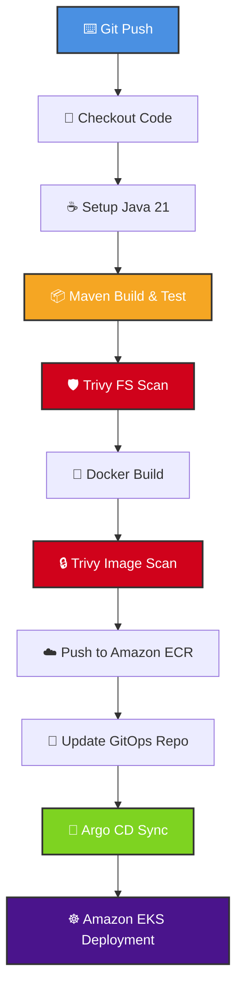

## This is a Spring Boot demo app built primarily as a DevOps practice project, what it does:

### The App itself (simple REST API on port 8080):

- GET / — returns a JSON response with a "DevOps Demo App Running" message + current timestamp

- GET /health — returns {"status": "UP"} as a health check

- GET /logs-test — fires off WARN and ERROR logs (used to test log pipelines)

- GET /validate?input=... — validates that a query param is non-empty, returns valid/invalid status

### The real purpose is DevOps toolchain integration, not the app logic itself. The project is wired up for:

- Nexus — artifact publishing (releases + snapshots) with the parameterized ${nexus.ip} you see in the README

- SonarQube — code quality scanning via the sonar-maven-plugin

- Prometheus + Actuator — metrics exposure at /actuator/prometheus

- ELK Stack — structured JSON logging via logstash-logback-encoder

- Docker — has a Dockerfile and .dockerignore

- Kubernetes — has a full k8s folder with deployment, service, ingress, HPA, and PVC manifests

## APP RELATED FIXES

### Manually editing pom.xml file everytime when nexus ip changes due to new infra or new project or any other senario is tiresome, so 

What we do instead is Parameterize those URLs using a custom Maven property. by replacing YOUR_NEXUS_IP:8081 with a placeholder variable like ${nexus.ip}:8081 inside pom.xml

How this helps : When you run your compilation step inside your Jenkinsfile later, you can dynamically inject the current active Nexus private IP straight from an environment variable using the standard Maven define flag:
`mvn clean deploy -Dnexus.ip=${NEXUS_PRIVATE_IP}`

## TO push docker img to ECR

- Authenticate docker into ecr using the ECR URI `aws ecr get-login-password --region us-east-1 | docker login --username AWS --password-stdin <account>.dkr.ecr.<region>.amazonaws.com/demo-java-app:v1`
- Build and tag image for ECR `docker build -f Dockerfile -t <account>.dkr.ecr.<region>.amazonaws.com/demo-java-app:v1 .`
- Push to ECR `docker push <account>.dkr.ecr.<region>.amazonaws.com/demo-java-app:v1`

## 🗺️ Pipeline Flowchart

---

## 🛠️ Stage Breakdown

### 1. Build & Test Phase
*   **Git Push:** Triggers the pipeline automatically on specified branch updates.
*   **Checkout:** Pulls the latest source code into the runner workspace.
*   **Java 21:** Configures the runtime environment with the Amazon Corretto or OpenJDK 21 distribution.
*   **Maven Build:** Executes `mvn clean package` and runs the **5 core unit tests** to ensure code stability.

### 2. Security & Artifact Phase
*   **Trivy Filesystem Scan:** Audits source code dependencies for known CVEs before compilation.
*   **Docker Build:** Packages the compiled Java JAR into a lightweight OCI-compliant container image.
*   **Trivy Image Scan:** Scans the final container image layers for OS vulnerabilities.
*   **Push Image to ECR:** Authenticates and uploads the verified secure image to Amazon Elastic Container Registry (ECR).

### 3. GitOps Deployment Phase
*   **Update GitOps Repo:** Automated script modifies the Kubernetes manifest image tags in a separate deployment repository.
*   **Argo CD:** Detects the Git repository deviation and triggers an automated synchronization process.
*   **EKS:** Deploys the application safely into the Amazon Elastic Kubernetes Service (EKS) cluster using a rolling update strategy.

---

## 📋 Prerequisites & Tools

| Tool | Purpose | Version Used |
| :--- | :--- | :--- |
| **Java** | Application Core | 21 |
| **Maven** | Build Automation | 3.9+ |
| **Trivy** | Security Vulnerability Scanner | Latest |
| **Docker** | Containerization engine | 24.0+ |
| **Argo CD** | Continuous Delivery / GitOps Controller | v2.10+ |
| **Amazon EKS** | Managed Kubernetes Environment | 1.29+ |
