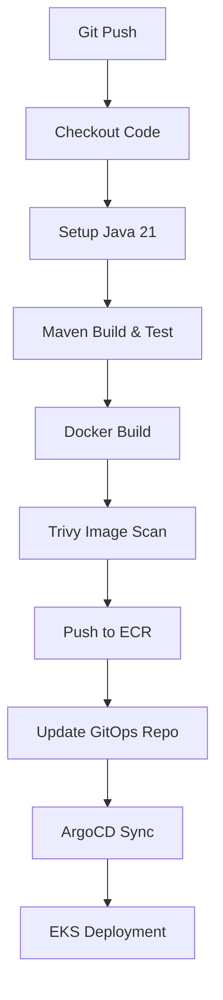

# Java Demo App

A Spring Boot REST API built as a DevOps practice project. Features person CRUD with Postgres, Flyway migrations, Prometheus metrics, and structured JSON logging.

---

## Run Locally (Docker)

```sh
cd local
docker compose up --build
```

App: `http://localhost:8080`  
Frontend (CRUD UI): `http://localhost:8080/index.html`

To stop and wipe data:
```sh
docker compose down -v
```

---

## API Endpoints

| Method | Endpoint | Description |
|---|---|---|
| GET | `/` | App status + timestamp |
| GET | `/health` | Health check |
| GET | `/actuator/health` | Detailed health (includes DB) |
| GET | `/actuator/prometheus` | Prometheus metrics |
| GET | `/logs-test` | Fires WARN + ERROR logs |
| GET | `/validate?input=` | Input validation |
| GET | `/persons` | List all persons |
| POST | `/persons` | Create person |
| PUT | `/persons/{id}` | Update person |
| DELETE | `/persons/{id}` | Delete person |

### Test CRUD via curl

```sh
# create
curl -X POST http://localhost:8080/persons \
  -H "Content-Type: application/json" \
  -d '{"name":"John Doe","dob":"1990-05-15","email":"john@example.com"}'

# read
curl http://localhost:8080/persons

# update
curl -X PUT http://localhost:8080/persons/1 \
  -H "Content-Type: application/json" \
  -d '{"name":"Jane Doe","dob":"1992-08-20","email":"jane@example.com"}'

# delete
curl -X DELETE http://localhost:8080/persons/1
```

---

## Run Tests

```sh
mvn test
```

Uses H2 in-memory DB — no Postgres needed. 5 tests covering all existing endpoints.

---

## Build JAR (CI/CD)

```sh
mvn clean package -DskipTests
docker build -t demo-java-app .
```

---

## Spring Profiles

| Profile | When | Flyway |
|---|---|---|
| default | K8s / prod | disabled (init container runs migrations) |
| `dev` | local Docker compose | enabled (runs on startup) |
| `test` | `mvn test` | disabled (H2 + JPA creates schema) |

---

## K8s Deployment

Manifests are in `k8s/`. ArgoCD watches this folder.

Before applying, fill in placeholders:
- `secret.yaml` — set `DB_PASSWORD`
- `deployment.yaml` — set `<YOUR_REGISTRY>/demo-java-app:<IMAGE_TAG>`
- `ingress.yaml` — set `<YOUR_DOMAIN>`

Apply order:
```sh
kubectl apply -f k8s/secret.yaml
kubectl apply -f k8s/postgres_pvc.yaml
kubectl apply -f k8s/postgres_deployment.yaml
kubectl apply -f k8s/postgres_svc.yaml
kubectl apply -f k8s/flyway-configmap.yaml
kubectl apply -f k8s/deployment.yaml
kubectl apply -f k8s/service.yaml
kubectl apply -f k8s/ingress.yaml
kubectl apply -f k8s/hpa.yaml
```

---

## CI/CD Pipeline (GitHub Actions)

Triggers on push to `main`. Pipeline: build → test → docker build → trivy scan → push to ECR → update GitOps repo → ArgoCD syncs → EKS deploys.

Required GitHub secrets:
| Secret | Value |
|---|---|
| `AWS_ID` | AWS account ID |
| `GH_TOKEN` | GitHub PAT with repo write access to infra repo |

---

## Nexus (optional)

```sh
mvn clean deploy -Dnexus.ip=<NEXUS_PRIVATE_IP>
```

## Pipeline Flowchart

